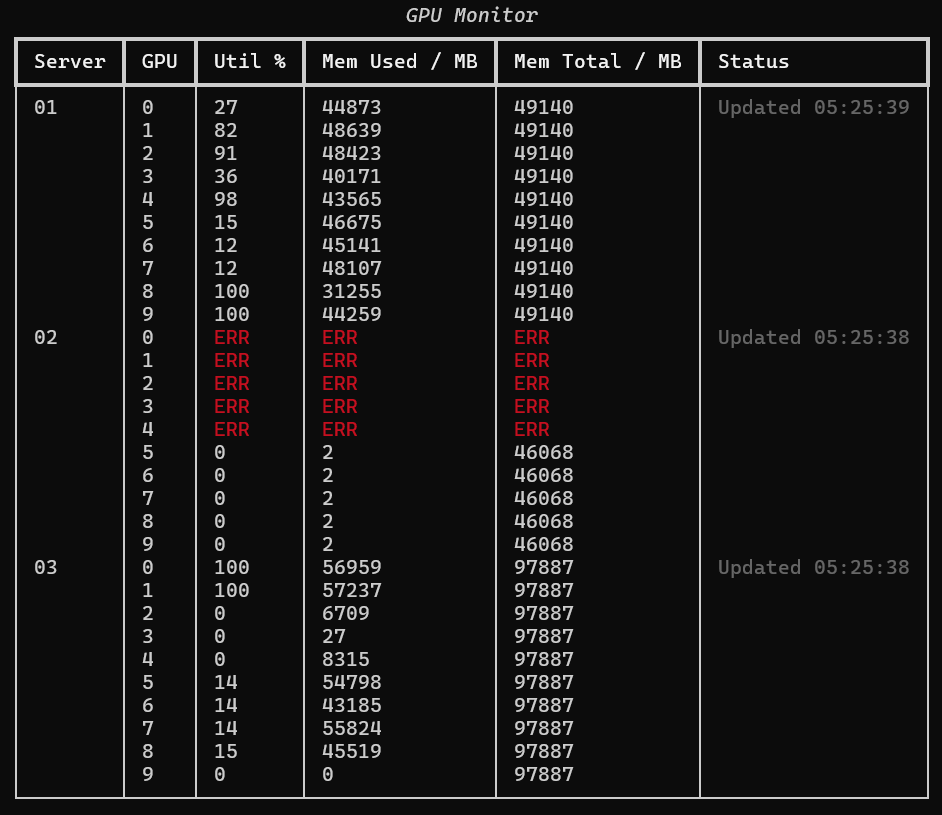

# Bed-SMI

A simple tool to monitor GPU usage of multiple servers. It uses `nvidia-smi` to query GPU information and displays it in a nice table format using the `rich` library.



## Usage

1. pip install asyncssh rich

2. Create a file named `servers` (or any name you prefer) and list your servers in the following format:

   ```
   server_name hostname [flags...]
   ```

   E.g.,

   ```
   01 nealchen@***.illinois.edu:22 check-err
   ```

   For advanced configurations, use with `.ssh/config`!

   Make sure to manually login to the servers at least once to add them to the known hosts.

3. Run the script:

   ```
   python bedsmi.py [servers]
   ```

   This will read the server information from the specified file and display the GPU usage in a table format.

## Flags

- `check-err`: If this flag is set, the script will check for the `reset_required` field in the GPU status (`Yes` means error). Some GPUs (like Pro 6000 Blackwell) do not have this field, never use this flag for them.
